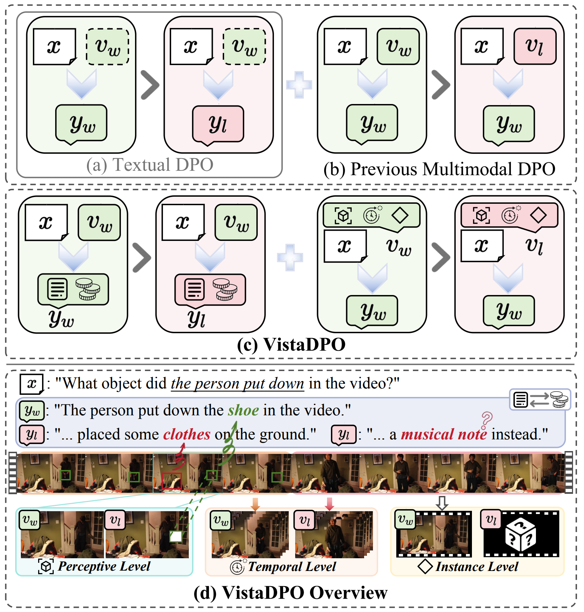

<!-- <p align="center">
    
<p> -->
<h2 align="center"> <a href="https://arxiv.org/abs/2504.13122">VistaDPO: Video Hierarchical Spatial-Temporal Direct Preference Optimization for Large Video Models</a></h2>
<!-- {: width="50%"} -->
<!--  -->
<div align="center">
<!-- </img> -->


_**[Haojian Huang](https://scholar.google.com.hk/citations?user=ab5uUAcAAAAJ&hl=zh-CN/)<sup>1*</sup>, [Haodong Chen](https://haroldchen19.github.io/)<sup>2*</sup>, [Shengqiong Wu](https://sqwu.top/)<sup>3</sup>, [Meng Luo](https://eurekaleo.github.io/)<sup>3</sup>, [Jinlan Fu](https://jinlanfu.github.io/)<sup>3</sup>, [Xinya Du](https://xinyadu.github.io/)<sup>4</sup>, [Hanwang Zhang](https://scholar.google.com/citations?user=YG0DFyYAAAAJ&hl=zh-CN)<sup>5</sup>, [Hao Fei](https://haofei.vip/)<sup>3†</sup>**_
<br><br>
<sup>*</sup>Equal Contribution, <sup>†</sup>Corresponding Author
<br>
<sup>1</sup>HKU, <sup>2</sup>HKUST, <sup>3</sup>NUS, <sup>4</sup>UTD, <sup>5</sup>NTU 

<h5 align="center"> If you like our project, please give us a star ⭐ on GitHub for latest update.  </h2>

 <a href='https://arxiv.org/abs/2504.13122'></a> &nbsp;
<a href='https://huggingface.co/datasets/Harold328/VistaDPO-7K'></a>&nbsp;

</div>

## Abstract
Large Video Models (LVMs) built upon Large Language Models (LLMs) have shown promise in video understanding but often suffer from misalignment with human intuition and video hallucination issues. To address these challenges, we introduce VistaDPO, a novel framework for Video Hierarchical Spatial-Temporal Direct Preference Optimization. VistaDPO enhances text-video preference alignment across three hierarchical levels: i) Instance Level, aligning overall video content with responses; ii) Temporal Level, aligning video temporal semantics with event descriptions; and iii) Perceptive Level, aligning spatial objects with language tokens. Given the lack of datasets for fine-grained video-language preference alignment, we construct VistaDPO-7k, a dataset of 7.2K QA pairs annotated with chosen and rejected responses, along with spatial-temporal grounding information such as timestamps, keyframes, and bounding boxes. Extensive experiments on benchmarks such as Video Hallucination, Video QA, and Captioning performance tasks demonstrate that VistaDPO significantly improves the performance of existing LVMs, effectively mitigating video-language misalignment and hallucination.

<table class="center">
    <tr>
    <td></td>
    </tr>
</table>
 
## 🔥 Update
- __[2025.04.18]__: Released VistaDPO [Paper](https://arxiv.org/abs/2504.13122).
- __[2025.04.03]__: Initialized this github repository and released training & inference code of VistaDPO on [Video-LLaVA](https://github.com/PKU-YuanGroup/Video-LLaVA).


## 🧰 TODO

- [x] Release Paper.
- [ ] Release VistaDPO-7K.
- [ ] Release VistaDPO model weights.
- [ ] Release code of VistaDPO on [PLLaVA](https://github.com/magic-research/PLLaVA).

<!-- ## 🧰 Models

|Model|Resolution|GPU Mem. & Inference Time (A100, ddim 50steps)|Checkpoint|
|:---------|:---------|:--------|:--------|
|DynamiCrafter1024|576x1024|18.3GB & 75s (`perframe_ae=True`)|[Hugging Face](https://huggingface.co/Doubiiu/DynamiCrafter_1024/blob/main/model.ckpt)|

Currently, our DynamiCrafter can support generating videos of up to 16 frames with a resolution of 576x1024. The inference time can be reduced by using fewer DDIM steps.

GPU memory consumed on RTX 4090 reported by @noguchis in [Twitter](https://x.com/noguchis/status/1754488826016432341?s=20): 18.3GB (576x1024), 12.8GB (320x512), 11.9GB (256x256). -->


## 📖 Contents
- [Dataset](#data)
- [Install](#install)
- [Inference](#inference)
- [Training](#training)


## 📝 Data

### Training data
We use our proposed VistaDPO-7k for training, which can be found in [HuggingFace](https://huggingface.co/datasets/Harold328/VistaDPO-7K). In this repo, we provide a subset of objects for reference in [data](data/video_data/train/vistadpo/object_set.jsonl).

### Evaluation data

The evaluation dataset utilized in our work are listed below: 
* Video Hallucination: VideoHallucer, EventHallusion.
* Video QA: MSVD, MSR-VTT, TGIF, ActivityNet, MVBench.
* Video Captioning: VideoChatGPT Bench

## 🚀 Install

1. Clone this repository and navigate to source folder
```bash
cd VistaDPO
```

2. Build Environment 


```Shell
echo "Creating conda environment"
conda create -n VistaDPO python=3.10
conda activate VistaDPO

echo "Installing dependencies"
pip install -r requirements.txt
```

## 📍 Inference

```python
from llava.model.builder import load_pretrained_model
from llava.mm_utils import get_model_name_from_path
from inference.inference_utils import ModelInference, decode2frame
import os
import torch

device = torch.device("cuda:0" if torch.cuda.is_available() else "cpu")

video_path = "./data/videos/_GTwKEPmB-U_5183.mp4"

# CACHE_DIR="/data/VistaDPO/cache"

model_path = "./checkpoints/VistaDPO" 
model_name = get_model_name_from_path(model_path)
tokenizer, model, processor, context_len = load_pretrained_model(model_path, model_base = None, device=device, model_name=model_name)
inference_model = ModelInference(model=model, tokenizer=tokenizer, processor=processor, context_len=context_len)

# our pipeline
frame_dir, _ = os.path.splitext(video_path)
decode2frame(video_path, frame_dir, verbose=True)
question="What is the evident theme in the video?"
response = inference_model.generate(
    question=question,
    modal_path=frame_dir,
    temperature=0,
)
print(response)

# using decord 
response = inference_model.generate(
    question=question,
    modal_path=video_path,
    temperature=0,
    video_decode_backend="decord",
)
print(response)
```

## 🚩 Training

VistaDPO training refer to [setup and training](./dpo_scripts/train_dpo.sh)
```Shell
bash dpo_scripts/train_dpo.sh
```


## 📝 Citation
Please consider citing our paper if our code and benchmark are useful:
```bib
@article{huang2025vistadpo,
    title={VistaDPO: Video Hierarchical Spatial-Temporal Direct Preference Optimization for Large Video Models},
    author={Huang, Haojian and Chen, Haodong and Wu, Shengqiong and Luo, Meng and Fu, Jinlan and Du, Xinya and Zhang, Hanwang and Fei, Hao},
    journal={arXiv preprint arXiv:2504.13122},
    year={2025}
}
```

## 🍗 Acknowledgement

Our VistaDPO is developed based on the codebases of [VideoLLaVA](https://github.com/PKU-YuanGroup/Video-LLaVA) and [PLLaVA](https://github.com/magic-research/PLLaVA), and we would like to thank the developers of both.


## 📪 Contact

For any question, feel free to email ```haojianhuang927@gmail.com``` or ```haroldchen328@gmail.com```.
